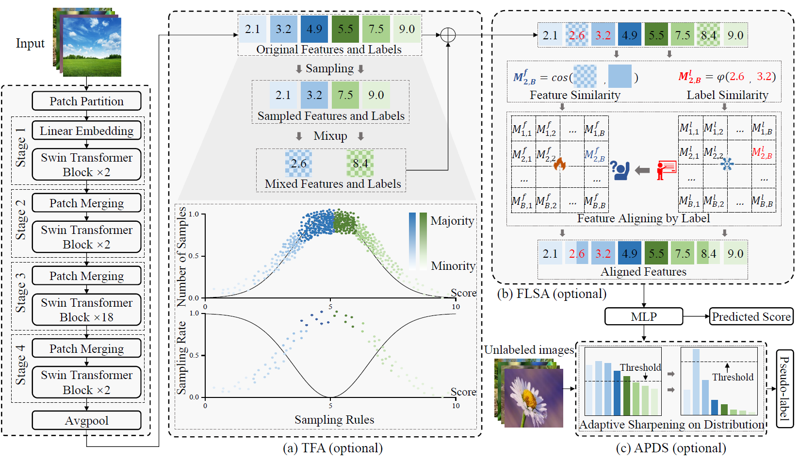

# Long-Tail-image-aesthetics-and-quality-assessment
ICML2024: First work to propose a solution to the long-tail problem in IAA. 首篇针对IAA中的长尾问题提出解决方案的工作


[](https://opensource.org/licenses/Apache-2.0)
[](https://pytorch.org/)

[[国内的小伙伴可以看这]](https://github.com/woshidandan/Long-Tail-image-aesthetics-and-quality-assessment/blob/main/CN_README.md)This repo contains the official implementation of ELTA of the **ICML 2024** paper.

<div align="center">
<h1>
<b>
ELTA: An Enhancer against Long-Tail for Aesthetics-oriented Models
</b>
</h1>
<h4>
<b>
Limin Liu*, Shuai He*, Anlong Ming*, Rui Xie, Huadong Ma
    
Beijing University of Posts and Telecommunications, *Equal contribution
</b>
</h4>
</div>

-----------------------------------------


## Introduction
 Real-world datasets often exhibit long-tailed distributions, compromising the generalization and fairness of learning-based models. This issue is particularly pronounced in Image Aesthetics Assessment (IAA) tasks, where such imbalance is difficult to mitigate due to a severe distribution mismatch between features and labels, as well as the great sensitivity of aesthetics to image variations.
To address these issues, we propose an Enhancer against Long-Tail for Aesthetics-oriented models (ELTA). ELTA first utilizes a dedicated mixup technique to enhance minority feature representation in high-level space while preserving their intrinsic aesthetic qualities. Next, it aligns features and labels through a similarity consistency approach, effectively alleviating the distribution mismatch. Finally, ELTA adopts a specific strategy to refine the output distribution, thereby enhancing the quality of pseudo-labels.



## Environment Installation
* einops==0.4.1
* matplotlib==3.3.4
* nni==2.6.1
* numpy==1.19.5
* pandas==1.1.5
* Pillow==10.2.0
* scikit_learn==1.4.0
* scipy==1.5.4
* timm==0.6.12
* torch==1.10.1
* torchvision==0.11.2
* tqdm==4.64.1


## Model training
```
python main.py --csv_path           [dataset annotation file path]
               --dataset_path       [dataset image path]
               --mixup              # optional, enable TFA module
               --simloss_weight 1   # optional, enable FLSA module and specify weight
               ...                  # other arguments
```

checkpoint file url: https://drive.google.com/file/d/1pA7kOCPHEUR5oNnocBZHH41Erud9Y30S/view?usp=drive_link

## Model evaluation
```
python main.py -e                   [dataset annotation file path]
               --test_dataset_path  [dataset image path]
               --resume             [checkpoint path]   # required!
               ...                  # other arguments
```

## Model self-training (after the evaluation)
```
python main.py --st                 # enable self-training
               ...                  # other arguments
```

## Recommended: use the NNI for automatic parameter tuning
```
# Modify the 'trial_command' and 'search_space' in the file 'main_nni.py'
python main_nni.py
```

## If you find our work is useful, pleaes cite our paper:
@inproceedings{liuelta,
  title={ELTA: An Enhancer against Long-Tail for Aesthetics-oriented Models},
  author={Liu, Limin and He, Shuai and Ming, Anlong and Xie, Rui and Ma, Huadong},
  booktitle={Forty-first International Conference on Machine Learning}
}


